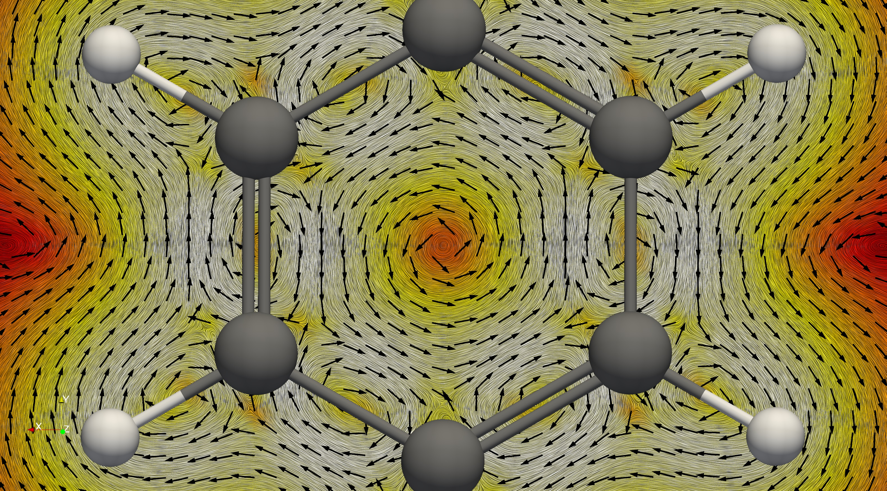
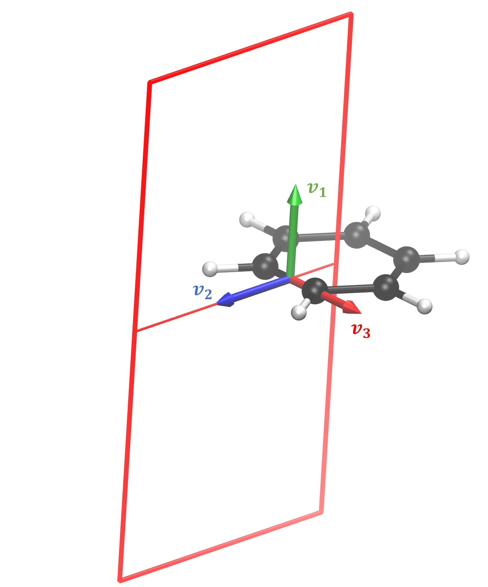

Interpretation of the results of GIMIC calculations
=====================================================

For the thorough interpretation of the induced current densities in a molecule
it is recommended to do both visual and quantitative investigation. It is
recommended to get a feeling of the molecule by running 3D calculations first.
After that, one can choose suitable locations for the integration planes that
will quantify the observed vortices.

It is important to keep that when placing an integration plane, we can only
determine whether the current flow to the left or to the right at each grid
point. This is caused by the fact that tropicity is a non-local property - i.e.
one needs to follow streamlines obtained with path integration in order to
determine whether the current flow is clockwise (diatropic) or counterclockwise
(paratropic) with respect to the magnetic field vector. When integrating
through a whole benzene molecule, there are two symmetric pairs of positive and
negative contributions exactly because the current flow on one side of the
vortex origin is going to the left with respect to the integration plane and in
then as it returns, it looks as if it is flowing to the right. One needs
topology analysis, which is not part of our code. We tackle the issue by
applying some intuition. We know that inside every molecular ring there should
be paratropic current, which we call negative simply out of convention. Then we
know that around every molecule (aromatic, non-aromatic, or antiaromatic) there
is a diatropic current, which we call positive.

We have a Youtube channel showing some of the basics:
https://www.youtube.com/channel/UC_5dN4qhYTOtr-itnsjoE0w/videos. 

3D integration
-----------------

A current density calculation can be performed using the ``cdens`` set of
keywords in the input file. It is possible to use the interactive script called
``3D-run.sh`` to define a box around the molecule and specify the distance
between the grid points. We recommend to use Paraview to visualise the results
(https://www.paraview.org/). Our recommended setup for Paraview can be seen in
this video (https://www.youtube.com/watch?v=NngG1g3Bb7Q&t=5s). 

The ``jvec.vti`` files is what concerns us the most. Also, it is necessary to
convert the molecular coordinates to CML format and bohr units. This is easily
done using the bash function ``molecule`` given in the description of the
section on the interactive scripts. 

It is possible to do streamline plots using the StreamTracer tool. Slices on a
plane can be done using the Surface LIC (line integral convolution) plug-in to
show the direction of the current flow. 

Streamline (spaghetti) plots 
~~~~~~~~~~~~~~~~~~~~~~~~~~~~~~~~~~~

.. image:: spaghetti.jpg
   :width: 200pt

In this video (https://www.youtube.com/watch?v=Pjy_0jucmGQ&t=28s) we present in
short how to create the streamline "spaghetti" plots using Paraview. A
pre-requisite is to have performed a current density calculations and that the
jvec.vti and mol-bohr.cml files exist. The latter is not directly written by
GIMIC but in the documentation we have suggested a bash function which creates
it. 

After the two files are loaded on the blank board we see the molecule and a
rectangular object which shows the boundaries of the defined integration grid
for the calculation. Then we apply the Stream Tracer tool. What is does is to
define some points in space and calculates their trajectory as if they were
particles moving in the vector field. It simply does path integration along the
direction defined by the vector field at each point. By default it uses a line
(High Resolution Line Source) as a seed type. It has to be changed to Point
Source from the drop-down menu. The next step is to change the radius of the
sphere. Usually a small sphere works better to distinguish different current
loops. The length of the field line can be defined to match the size of the
molecule. An important parameter is the Integration Direction. Forward or
backward directions can be used to visually determine the tropicity of the
current flow. One needs to check the magnetic field direction defined in the
calculation and then look at the molecule along that axis. For example when the
field points to the negative Z direction, then one needs to rotate the
molecule, so that the view is towards the negative Z axis. Setting forward
integration direction produces the correct tropicity direction according to the
convention. It is accepted that diatropic current flow clockwise, while
paratropic currents - counterclockwise. In any molecule on the outside, far
from the nuclei, there is diatropic flow with strength determined by the
magnetic response. Also, in the vicinity of the atomic nuclei there also are
diatropic currents flowing clockwise. Inside molecular rings there is a
paratropic counterclockwise current pathway, irrespective of whether the ring
is aromatic or antiaromatic. 

It appears that our job is already finished here, however we have not
considered yet the current strength. Many of the curves turn out to be very
weak and negligible. The lines can be made thicker by applying the Tube filter
and a suitable colour scheme can be set with a suitable range of values. We
typically use the Blackbody radiation scheme with range [1e-6; 0.1], however
based on the particular investigated molecule the range may need to be
adjusted. With that done one can freely explore the streamlines in the
molecule. It is sometimes useful to make a very small sphere but with many
points. When the result looks good the view can be saved as PNG, for example.
It is recommended to export high-resolution images with high quality
compression in case of JPG format. 

Line integral convolution on a surface
~~~~~~~~~~~~~~~~~~~~~~~~~~~~~~~~~~~~~~~~

(coming)

Integration planes 
-------------------

Current profile integration
~~~~~~~~~~~~~~~~~~~~~~~~~~~~~~~~~~~~~~~~

In this video we present how to interactively calculate a current profile
across a bond in GIMIC. We start off in a directory where the nuclear shielding
calculation for the benzene molecule has been executed with Turbomole. 

The molecular coordinates can be previewed by converting the TURBOMOLE coord
file to XYZ format using the t2x program. In this example we show the
coordinates in the basic XMAKEMOL program. It is lightweight and works over SSH
smoothly. XMAKEMOL loads a molecule showing hydrogen bonds as dashed lines.
They can be turned off by pressing the H key on the keyboard. The atomic
indices can be shown by pressing the N key. The latter is needed for the
definition of the integration plane. Zooming in closer can be done by pressing
CTRL + P. The first slider changes the zoom level. The "Toggle depth" option
switches between perspective and orthographic projection of the atoms. XMAKEMOL
can be downloaded from http://www.nongnu.org/xmakemol. Please note that we are
not affiliated or contributing to the development of XMAKEMOL in any way. Of
course, one can use any other molecular visualisation program, such as Molden
or VMD. 

When we have inspected the molecular geometry and selected the bond through
which to place an integration plane, it is time to prepare the gimic input
files. The files CAODENS and XCAODENS contain the unperturbed and the
magnetically perturbed density matrices. If they are missing, then the nuclear
shielding calculation did not complete. They are converted to the file XDENS
using the Python script turbo2gimic.py. It is handy to define it as a bash
alias. Please pipe the output to the file called MOL. 

With that done, the current profile script can be called. In this example we
show the version for a cluster, however, it can be used in the same manner on a
local machine. It is good to remember that GIMIC works in atomic units. We have
decided to integrate the current in the benzene molecule. This can be done by
placing an integration plane across any of the C = C bonds. The bond is defined
using the indices of the atoms according to the coord file. XMAKEMOL makes the
choice easy by displaying the indices. NOTE to VMD users! The first atom in the
XYZ file has the index one. VMD lists the indices starting from 0, so the given
index needs to be increase by one. In this example we chose to integrate across
the bond between atoms 4 and 5. According to our convention the atoms are
entered in clockwise order, i.e. 4 -- 5 instead of 5 -- 4 in this case. The
scripts asks for a possible suffix for the directory name. This can be
generally omitted, however sometimes it might be necessary to run calculations
across the same bond but along different integration planes. In practice this
means that if the suffix "modified" is entered, then the created calculation
directory is current_profile_4.5_modified. 

Next, we need to define at which point the bond and the integration plane
cross. Unless there is a particular reason, we set the plane to cross the
midpoint of the bond. Possible reasons to shift it would be, for example,
additional current vortices, which might interfere with the estimation of the
currents. 

.. image:: intplane.jpg
   :width: 200px

Then the integration plane has to be positioned in space. Integration always
occurs from right to left, so keep that in mind when defining the in and out
distances. The in value can be defined either by specifying atomic indices or
by choosing a certain value away from the bond. In the presented case we chose
to integrate from the centre of the ring to infinity. Clearly, in this case it
is easier to define the starting point through the indices of three atoms. This
is done by entering the indices in arbitrary order but on the same line. The
geometrical centroid of the hexagon is printed. For symmetric molecules, such
as benzene, this is a good starting point. Otherwise, it is recommended to
increase the distance a bit since the current vortex is not symmetric, either.
In this example we increase the value by about 0.15 bohr. We want the end point
to be infinitely far away from the molecule, where the current vanished.
Practice has shown that usually at 8 bohr away from the bond, the current
reaches 0. Similarly, we integrate infinitely far above and below the molecule
by setting the up and down values to 8 bohr. 

The next steps is to specify the thickness of the slices. We recommend to use
0.02 bohr to produce a nice high-resolution plot. Each slice is executed as a
separate calculation. Grid point spacing refers to the grid for each slice. The
pre-defined values have proven to yield good results. 

The magnetic field direction can be specified in several different ways. The
strongest currents are induced when the field is perpendicular to the molecular
ring. Traditionally, molecules are placed to lie in the xy plane, thus the
magnetic field vector B = (0; 0; -1). In some cases it is necessary to rotate
the field with respect to the integration plane. For example, bond currents can
be calculated by setting B = (-1; 0; 0) in the chosen example, so that the
field is perpendicular to the bond but lies in the plane of the benzene
molecule. However, this definition of B || X, Y or Z can be overridden. If the
molecule was not placed in the xy plane, and particularly in non-planar
molecules, it is best to define the atoms with respect to which the field will
be perpendicular. The tools maximize_projection and plane in the GIMIC
repository need to be available for the automatic calculation of the field
vector. 

Afterwards, it is necessary to define the "fixed point". It is the third point
which specifies the integration plane. The script attempts to calculate it,
however, it sometimes fails. In those cases, one needs to manually try and
choose an atom which is located clockwise with respect to the bond atoms (4 and
5 in this example). Having done that, one can further rotate the integration
plane if needed. It can be done by entering an angle in degrees. By default,
the origin of rotation is the bond midpoint, however, the origin can be
modified if needed. 

The script prints a summary of the defined integration plane and performs a dry
run for the first slice of the integration plane. 

(to be continued, and the video has to be finished)

